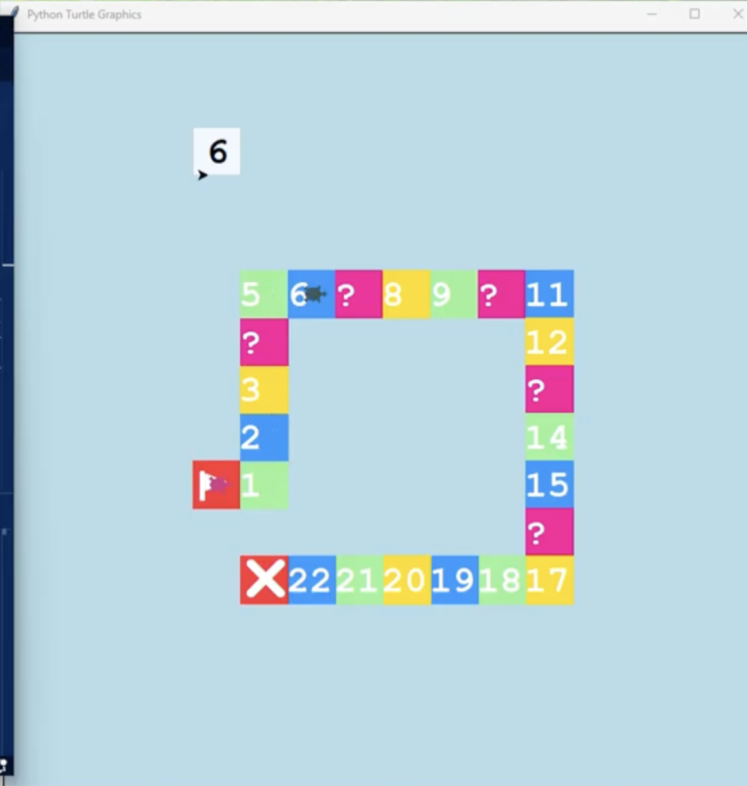

# Four-Player Board Game

A local turn-based Python board game with four pieces, dice rolls, corner movement, and mystery spaces.

[View my programming portfolio](https://charliebarra.github.io/portfolio/programming.html)



## The Question

How do you make four different pieces follow the same board while remembering where each one is supposed to go next?

## What I Built

I built a four-player board game with Python's Turtle graphics. Players take turns rolling a die, their pieces move around a rectangular path, and mystery spaces can move a piece forward, backward, back to the start, or straight to the finish.

The mystery blocks are the feature I am weirdly proud of. They made the board less predictable and gave the movement system more ways to break, which it definitely used.

## How It Works

- Four Turtle objects represent the players.
- A shared controller tracks each piece's coordinates and movement.
- Corner checks change a piece's direction as it moves around the board.
- A random number from 1 to 6 acts as the die roll.
- Mystery spaces trigger one of four random movement effects.
- A turn loop cycles through the four local players until someone reaches the finish.

## Something That Surprised Me

Getting the pieces to move around the board took the longest. The bug that drove me crazy was extremely specific: after a piece was sent backward, it would fail to turn at only one of the corners. Most of the board still worked, which made that one corner harder to find and fix.

## What I Would Change Next

I would make the board bigger and add more spaces that affect what happens, instead of having most spaces only move the player along the path.

## Run It

This project uses Python 3 and its standard `turtle` module. It needs a desktop environment that can open a graphics window and a terminal for turn prompts.

```bash
python3 src/4player_turtle_boardgame_nov5.py
```

When prompted, enter an uppercase `Y` to roll for the current player.

## Files

- `src/4player_turtle_boardgame_nov5.py` — original source code, preserved unchanged
- `images/multiplayer-screenshot.png` — original gameplay screenshot
- `SOURCE-INTEGRITY.md` — checksum for verifying the source file

## Source Integrity

The original source is intentionally unchanged. This is a local, turn-based four-player project; the README does not claim online networking or synchronization that the code does not contain.
